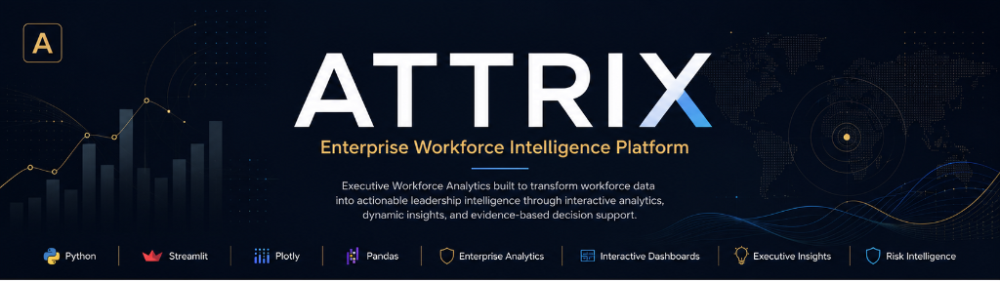
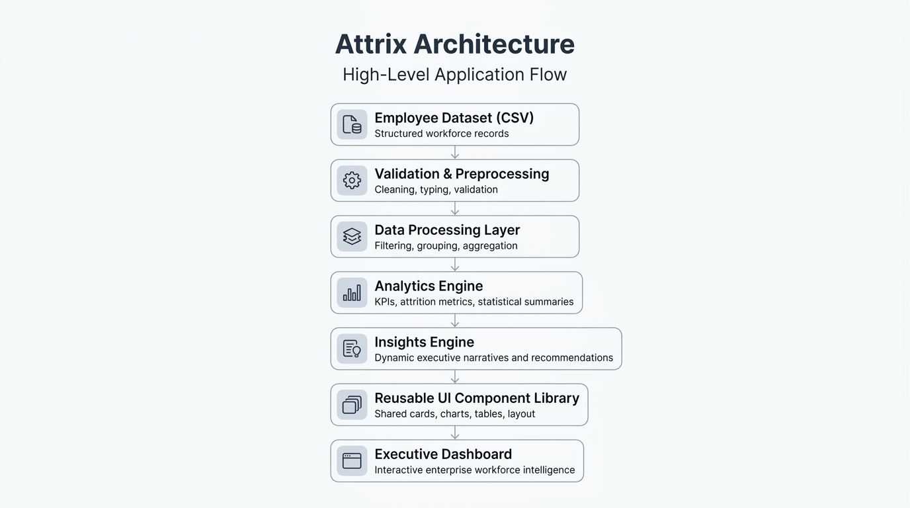
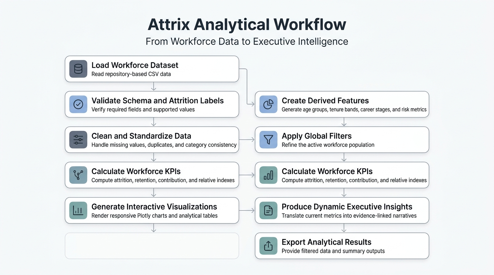

<p align="center">
  
</p>

<h1 align="center">Attrix</h1>

<p align="center">
  Enterprise Workforce Intelligence Platform
</p>

<p align="center">
  Interactive workforce analytics, executive insights, and organizational risk-hotspot exploration built with Python and Streamlit.
</p>

<p align="center">
  <a href="https://python.org"></a>
  <a href="https://streamlit.io"></a>
  <a href="https://plotly.com"></a>
  <a href="https://pandas.pydata.org"></a>
  
  
  
</p>

<p align="center">
  <a href="#live-product-walkthrough">Demo</a> •
  <a href="#key-capabilities">Features</a> •
  <a href="#architecture">Architecture</a> •
  <a href="#screenshots">Screenshots</a> •
  <a href="#getting-started">Installation</a> •
  <a href="#license">License</a>
</p>

---

## Table of Contents
1. [Product Overview](#product-overview)
2. [Live Product Walkthrough](#live-product-walkthrough)
3. [Why Attrix](#why-attrix)
4. [Key Capabilities](#key-capabilities)
5. [Application Modules](#application-modules)
6. [Architecture](#architecture)
7. [Analytical Workflow](#analytical-workflow)
8. [Repository Structure](#repository-structure)
9. [Getting Started](#getting-started)
10. [Running Locally](#running-locally)
11. [Testing](#testing)
12. [Dataset and Analytical Scope](#dataset-and-analytical-scope)
13. [Responsible Interpretation](#responsible-interpretation)
14. [Screenshots](#screenshots)
15. [Roadmap](#roadmap)
16. [License](#license)
17. [Author](#author)

---

## Product Overview

Attrix is an interactive workforce analytics case study platform built to explore employee attrition drivers across departments, job roles, demographics, tenure, workload, mobility, and organizational hotspots. It processes structured workforce records to calculate KPIs and run statistical checks, enabling recruiters, mentors, and people analysts to isolate functional turnover patterns and explore evidence-backed recommendations in real time. Rather than automate decisions, Attrix facilitates diagnostic investigation on filtered cohorts via a fully responsive, custom-styled interface.

---

## Live Product Walkthrough

<p align="center">
  
</p>

A short walkthrough of filtering, executive insights, organizational analysis, risk prioritization, and theme switching.

---

## Why Attrix

Employee attrition presents significant organizational challenges:
* **Knowledge Loss:** The departure of key team members disrupts operational continuity.
* **Replacement Costs:** Recruitment, hiring, and training ramps create substantial financial overhead.
* **Team Disruption:** Elevated turnover rates degrade team morale and project velocity.

Attrix addresses these issues by replacing generalized assumptions with focused, data-driven insights. By highlighting where voluntary exits are concentrated and isolating the exact parameters linked to elevated attrition, leadership can allocate resources to high-risk segments and stabilize organizational retention.

---

## Key Capabilities

### Workforce Intelligence
* **Segmented Comparisons:** Isolate attrition rates by department, age brackets, years-at-company cohorts, and job roles against filtered baselines.
* **Workload & Mobility Correlation:** Trace the relative significance of overtime demands, travel schedules, and long commute distances as exit drivers.
* **Tenure Continuity Analysis:** Identify early-career risk boundaries, promotion interval gaps, and manager changes.

### Executive Decision Support
* **Hotspots Matrix:** Rank segment risk indexes dynamically using rate, exit volume, and active headcounts.
* **Dynamic Briefings:** Auto-generate natural language observations and recommendations directly from current data filter intersections.
* **Operational Directives:** Outlines clear interventions linked to confidence ratings and department ownership.

### Product Experience
* **Centralized Design System:** Implements visual tokens for typography, card surfaces, and padding overrides.
* **Light / Dark Theme Support:** Seamlessly adapts to Streamlit setting toggles (Light, Dark, and System modes).
* **Transparent Visuals:** Plotly graphs automatically inherit backgrounds and gridline colors from active system preferences.

### Engineering Quality
* **Cached Data Loading:** Ensures page changes load instantly by storing clean dataframes in session memory.
* **Robust Empty States:** Displays structured guidance layouts if filter subsets yield zero matching rows.
* **Automated Unit Testing:** Codebase features full verification tests for calculation methods and subset parameters.

---

## Application Modules

* **Executive Overview:** Unified view of flagship workforce metrics, priority alerts, and functional summaries.
* **Departments & Roles:** Detailed exploration of departmental exit rates and top high-risk job role distributions.
* **Demographic Explorer:** Segmentation by age bands, gender splits, marital status, and educational backgrounds.
* **Tenure & Career:** Breakdown of voluntary exits across promotion timelines, manager continuity, and years-at-company cohorts.
* **Workload & Mobility:** Evaluation of overtime demands, travel indices, and commute distance metrics as attrition drivers.
* **Risk Hotspots:** Matrix workspace mapping workforce segments based on rates and exit volume.
* **Insights & Recommendations:** Action-oriented briefing center outlining evidence-backed interventions and priority ratings.
* **Methodology & Data Quality:** Technical disclosure of calculations, statistical tests, data validation profiles, and uploader controls.

---

## Architecture

<p align="center">
  
</p>

Attrix is engineered on a decoupled modular architecture that maintains a strict separation of concerns. Raw workforce data is loaded and validated by the data engine, which passes the clean results to the filtering and analytics layer. Calculations, metrics, and statistical tests compute the active cohort datasets in real time. The dynamic insights engine subsequently parses the metrics to output natural language narrative summaries and action recommendations. Reusable component layouts consume the structured visual data to render optimized charts, cards, and tables.

---

## Analytical Workflow

<p align="center">
  
</p>

The analytical workflow is a sequential flow from data ingestion to exported intelligence. After loading and validating employee database records, standard preprocessing pipelines handle null ranges and duplication. Derived features classify age, tenure, and career profiles before global filter parameters refine the active subset. Core metrics, attrition variables, and statistical significance indexes are calculated to feed Plotly charts and tables. In the final phases, metric triggers populate dynamic executive briefings and prioritize immediate risk hotspots for downstream CSV exports.

---

## Repository Structure

```text
Attrix/
├── .streamlit/                # Streamlit settings and presets
│   └── config.toml            # Interface configurations
├── assets/                    # Project styling assets
│   ├── branding/              # Dark/Light banners
│   ├── diagrams/              # Architecture & Workflow diagrams
│   ├── gifs/                  # Demo walkthroughs
│   └── icons/                 # Custom SVG favicon
├── components/                # Reusable UI component library
│   ├── disclaimer.py          # Academic and statistical limitations
│   ├── empty_states.py        # Empty filter results display
│   ├── footer.py              # Page footer elements
│   ├── header.py              # Injected CSS styles and filters
│   ├── kpi_cards.py           # Metric snapshot cards
│   ├── page_header.py         # Standard page heading blocks
│   └── status_strip.py        # Status pill indicators
├── config/                    # Global settings variables
│   └── settings.py            # Fonts, dimensions, and color mappings
├── data/                      # Dataset repository
│   └── raw/                   # Raw source file location
├── pages/                     # Application sub-pages
│   ├── demographics.py        # Demographic Explorer page
│   ├── department_roles.py    # Departments & Roles page
│   ├── methodology.py         # Methodology & Data Quality page
│   ├── overview.py            # Executive Overview page
│   ├── recommendations.py     # Insights & Recommendations page
│   ├── risk_hotspots.py       # Risk Hotspots page
│   ├── tenure_career.py       # Tenure & Career page
│   └── workload_mobility.py   # Workload & Mobility page
├── reports/                   # Documented briefs
│   ├── data_dictionary.md     # Variables definition glossary
│   ├── executive_summary.md   # Executive summary brief
│   └── research_paper.md      # Statistical research paper
├── services/                  # Business logic services
│   └── insights_engine.py     # Dynamic insights engine
├── tests/                     # Unit test suites
│   ├── test_data_cleaning.py  # Data quality tests
│   ├── test_feature_engineering.py # Categorization tests
│   ├── test_filters.py        # Subset filter tests
│   └── test_metrics.py        # Numerical calculations tests
├── utils/                     # Analytics helpers
│   ├── chart_theme.py         # Plotly trace templates
│   ├── data_cleaning.py       # Data validation routines
│   ├── data_loader.py         # Data caching managers
│   ├── exports.py             # CSV/Markdown exporters
│   ├── filtering.py           # Multi-criteria filter routines
│   ├── metrics.py             # Mathematical calculations
│   └── statistics.py          # Chi-Square / Mann-Whitney helpers
├── app.py                     # App routing entry point
├── requirements.txt           # Core library requirements
└── README.md                  # Main developer documentation
```

---

## Getting Started

### Prerequisites
* **Python 3.9** or later
* **Git** installed on your workstation

### Installation
Clone the repository:
```bash
git clone https://github.com/yasaswi1501/Attrix.git
cd Attrix
```

Set up a virtual environment:
* **macOS / Linux:**
  ```bash
  python3 -m venv .venv
  source .venv/bin/activate
  ```
* **Windows (PowerShell):**
  ```powershell
  python -m venv .venv
  .venv\Scripts\Activate.ps1
  ```

Upgrade pip and install dependencies:
```bash
python -m pip install --upgrade pip
python -m pip install -r requirements.txt
```

> **Note:** On some macOS systems, use `python3` instead of `python` for all execution commands.

---

## Running Locally

To launch the dashboard server, run:
```bash
python -m streamlit run app.py
```

On macOS systems where `python3` is mapped explicitly:
```bash
python3 -m streamlit run app.py
```

The application will start and open automatically in your browser at:
`http://localhost:8501`

---

## Testing

Attrix uses a pytest configuration to ensure analytics and data loader utilities are accurate.

To execute the test suite:
```bash
python -m pytest
```

Alternative for macOS:
```bash
python3 -m pytest
```

The tests cover:
* **Data Cleaning:** Validation of raw variables, null removals, and text normalizations.
* **Feature Engineering:** Categorization of age boundaries, years at company cohorts, and promotion intervals.
* **Filter Intersections:** Verification that multi-select options apply across intersecting subsets.
* **Metrics:** Accurate calculation of attrition percentages, retention values, and promotional rates.

---

## Dataset and Analytical Scope

The application parses a workforce dataset containing variables that describe:
* **Organizational Attributes:** Department, Job Role, Job Level, Standard Hours, Income.
* **Workload & Mobility:** Overtime status, Business Travel intensity, Commute distance.
* **Tenure & Continuity:** Total working years, Years at company, Years in current role, Years since last promotion, Years with current manager.
* **Demographics:** Age, Gender, Marital Status, Education Level, Education Field.
* **Employee Sentiment:** Environment satisfaction, Work-Life balance, Job involvement, Performance rating.

All attributes are processed and validated at runtime, and any incomplete records are handled automatically by the validation layer.

---

## Responsible Interpretation

When analyzing workforce data, please keep the following guidelines in mind:
* **Descriptive Scope:** Attrix presents associations and patterns inside the dataset. These correlations highlight potential trends but do establish direct causation.
* **Bias Avoidance:** Demographic data (such as age, gender, or marital status) must be analyzed responsibly and must not be used to make discriminatory personnel decisions.
* **Small Sample Sizes:** When applying multiple filters, cohort sizes may drop significantly. Interpret results for small cohorts carefully, as high percentage fluctuations may occur.
* **Qualitative Context:** Quantitative analytical findings should be combined with employee feedback surveys, exit interviews, and organizational context.

---

## Screenshots

### Executive Overview

<p align="center">
  
</p>

A high-level view of workforce health, attrition KPIs, leadership priorities, and organizational signals.

### Departments & Roles

<p align="center">
  
</p>

Department and job-role comparisons using attrition rate, exit volume, and organizational baseline context.

### Demographic Explorer

<p align="center">
  
</p>

Responsible workforce segmentation across age, gender, marital status, education, and education fields.

### Tenure & Career

<p align="center">
  
</p>

Organizational tenure, early-tenure exits, career stages, promotion intervals, and manager continuity.

### Workload & Mobility

<p align="center">
  
</p>

Overtime, business travel, commute distance, work-life balance, satisfaction, and involvement analysis.

### Risk Hotspots

<p align="center">
  
</p>

Integrated hotspot prioritization using rate, volume, contribution, sample size, and relative index.

### Insights & Recommendations

<p align="center">
  
</p>

Dynamic, evidence-linked narratives and leadership recommendations generated from the active filtered population.

### Methodology & Data Quality

<p align="center">
  
</p>

Transparent analytical definitions, data validation, derived metrics, limitations, and responsible interpretation guidance.

---

## Roadmap

Planned improvements for future updates include:
* **Configurable Data Ingestion:** Standard data mapping controls enabling uploads of custom CSV formats.
* **Role-Based Access Control:** Secure user logins for restricted department views.
* **Additional Export Formats:** Support for exporting analytical reports as PDF or presentation slides.
* **Historical Trend Analysis:** Time-series tracking models as multi-period workforce history datasets become available.
* **Cloud Deployment Automation:** Deployment configurations for common hosting providers.

---

## License

License information has not yet been added.

---

## Author

**Yasaswi Vadrevu**
* GitHub Profile: [https://github.com/yasaswi1501](https://github.com/yasaswi1501)
